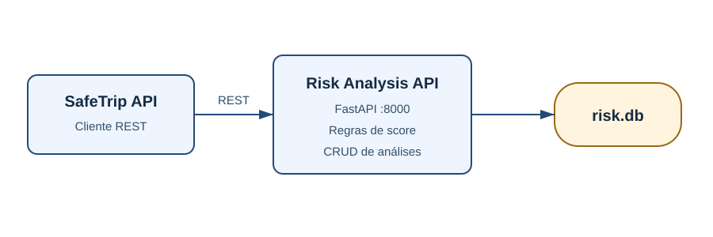

# SafeTrip Risk Analysis API

API secundária do SafeTrip. Recebe dados básicos da viagem e do clima, calcula um score determinístico, classifica o risco e persiste a análise em um banco SQLite próprio. Ela é autônoma e não acessa o banco da SafeTrip API.



## Tecnologias

- Python 3.12+
- FastAPI e Pydantic
- SQLAlchemy 2 e SQLite
- Uvicorn
- Pytest
- Docker

## Regra de risco

| Condição | Pontos | Alerta |
|---|---:|---|
| Precipitação maior que 10 mm | +30 | `Heavy precipitation` |
| Vento maior que 50 km/h | +30 | `Strong winds` |
| Temperatura menor que 5 °C | +20 | `Low temperature` |
| Temperatura maior que 40 °C | +20 | `High temperature` |

O score é limitado a 100. A classificação é `LOW` (0–30), `MODERATE` (31–60), `HIGH` (61–80) ou `CRITICAL` (81–100).

## Estrutura dos projetos

Os diretórios `safetrip-api` [SafeTrip API](https://github.com/juliobjj/safetrip-api) e `safetrip-risk-api` devem estar no **mesmo diretório raiz**, pois o Docker Compose realiza o build dos dois projetos.

Estrutura recomendada:

```text
safetrip/
├── safetrip-api/
└── safetrip-risk-api/
```

## Instalação e execução local

Na raiz deste projeto:

```bash
python -m venv .venv
```

No Linux/macOS:

```bash
source .venv/bin/activate
```

No Windows PowerShell:

```powershell
.venv\Scripts\Activate.ps1
```

Instale e execute:

```bash
pip install -r requirements.txt
uvicorn app.main:app --reload --port 8001
```

Opcionalmente, copie `.env.example` para `.env`. O padrão local é `DATABASE_URL=sqlite:///./risk.db`.

- API: <http://localhost:8001>
- Swagger: <http://localhost:8001/docs>

## Execução com Docker

```bash
docker build -t safetrip-risk-api .
docker run --rm -p 8001:8000 -e DATABASE_URL=sqlite:////data/risk.db -v safetrip-risk-data:/data safetrip-risk-api
```

Para iniciar todo o sistema, use o `docker-compose.yml` do projeto irmão `safetrip-api`.

## Rotas

| Método | Rota | Finalidade |
|---|---|---|
| POST | `/risk-analysis` | Calcular e criar uma análise |
| GET | `/risk-analysis` | Listar análises |
| GET | `/risk-analysis/{id}` | Consultar uma análise |
| PUT | `/risk-analysis/{id}` | Ajustar score, classificação ou alertas |
| DELETE | `/risk-analysis/{id}` | Excluir uma análise |
| GET | `/health` | Verificar a saúde da API |

### Exemplo

```bash
curl -X POST http://localhost:8001/risk-analysis \
  -H "Content-Type: application/json" \
  -d '{"trip_id":1,"vehicle_type":"truck","temperature":18,"precipitation":22,"wind_speed":65}'
```

Resposta `201 Created`:

```json
{
  "id": 1,
  "trip_id": 1,
  "score": 60,
  "classification": "MODERATE",
  "warnings": ["Heavy precipitation", "Strong winds"],
  "created_at": "2026-09-17T19:00:00Z"
}
```

Erros usam o formato `{"detail": "Risk analysis not found"}`. Dados inválidos são rejeitados com `422` pelo contrato Pydantic.

## Testes

```bash
pip install -r requirements-dev.txt
pytest -q
```

Os testes usam SQLite em memória e não dependem da SafeTrip API.

